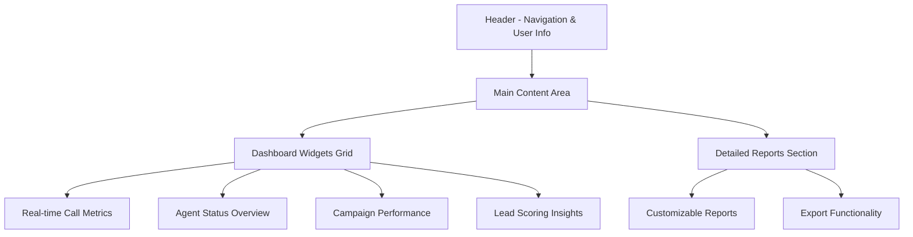

# rulimena.io Admin Panel and Dashboard Design

## Overview
This document outlines the design for the admin panel and dashboard of rulimena.io, providing real-time monitoring, analytics, and management capabilities for supervisors and administrators.

## Dashboard Layout

### Main Dashboard Structure

### Responsive Design Considerations
- Desktop-first approach with mobile responsiveness
- Grid-based layout for optimal information density
- Collapsible sections for information management
- Dark theme option for reduced eye strain during long shifts

## Dashboard Components

### 1. Real-time Call Metrics Widget

#### Key Metrics Displayed
- **Active Calls**: Number of currently connected calls
- **Call Queue**: Number of calls waiting to be connected
- **Answer Rate**: Percentage of answered calls
- **Average Wait Time**: Average time customers wait before connection
- **Call Volume**: Calls per minute/hour/day
- **Abandon Rate**: Percentage of calls abandoned before connection

#### Visual Elements
- Large numerical displays for key metrics
- Trend indicators (up/down arrows with percentages)
- Real-time updating charts (last 60 minutes)
- Color-coded status indicators (green/yellow/red)

### 2. Agent Status Overview Widget

#### Agent Status Distribution
- Available agents count
- On-call agents count
- Break/Lunch agents count
- Offline agents count
- Training agents count

#### Agent Performance Summary
- Top performers (by conversion rate)
- Agents needing assistance (low performance)
- Average handle time
- Agent utilization rate

#### Interactive Features
- Click to view individual agent details
- Real-time status updates
- Agent assignment management

### 3. Campaign Performance Widget

#### Campaign Metrics
- Active campaigns count
- Campaign completion percentage
- Conversion rates by campaign
- Revenue generated (if applicable)
- Cost per lead/call

#### Campaign Status Visualization
- Progress bars for each campaign
- Color coding (on track, at risk, behind schedule)
- Quick campaign management actions

### 4. Lead Scoring Insights Widget

#### Predictive Scoring Overview
- High-score leads count
- Medium-score leads count
- Low-score leads count
- Scoring model accuracy

#### Scoring Trends
- Score distribution chart
- Conversion rate by score range
- Model performance metrics

### 5. System Health Widget

#### Infrastructure Status
- WebSocket server status
- Database connectivity
- API response times
- Active user sessions

#### Alert Monitoring
- Critical alerts requiring immediate attention
- Warning indicators for potential issues
- System maintenance notifications

## Detailed Reports Section

### Report Types

#### 1. Call Analytics Report
- Call volume trends
- Answer rate analysis
- Average handle time
- Call abandonment rates
- Call duration distribution

#### 2. Agent Performance Report
- Individual agent metrics
- Team performance comparisons
- Productivity trends
- Quality assurance scores

#### 3. Campaign Effectiveness Report
- Campaign ROI analysis
- Conversion rate tracking
- Lead source performance
- Cost per acquisition

#### 4. Predictive Scoring Report
- Model accuracy metrics
- Score distribution analysis
- Conversion correlation by score
- Model improvement recommendations

### Report Features
- Custom date range selection
- Data filtering and segmentation
- Export to PDF/Excel/CSV
- Scheduled report delivery
- Interactive charts and graphs

## User Management Interface

### User Directory
- Searchable list of all system users
- Role-based filtering (admin/supervisor/agent)
- Status indicators (active/inactive)
- Quick actions (edit, disable, reset password)

### User Profile Management
- Personal information editing
- Role assignment and modification
- Permission management
- Activity history tracking

### Team Management
- Team creation and assignment
- Team performance metrics
- Supervisor assignment
- Team-based reporting

## Campaign Management Interface

### Campaign Creation Wizard
- Step-by-step campaign setup
- Contact list upload and validation
- Dialing strategy selection (manual/turbo/predictive)
- Script template assignment
- Schedule configuration

### Campaign Monitoring
- Real-time campaign status
- Performance metrics dashboard
- Call distribution visualization
- Adjustment controls for ongoing campaigns

### Campaign Analytics
- Detailed performance breakdown
- Conversion tracking
- Cost analysis
- Optimization recommendations

## Agent Performance Tracking

### Individual Agent Dashboard
- Personal performance metrics
- Call history and recordings
- Quality scores
- Training recommendations
- Goal tracking

### Team Performance Dashboard
- Team metrics comparison
- Leaderboard rankings
- Performance trend analysis
- Coaching opportunity identification

### Performance Improvement Tools
- Skill gap analysis
- Training module recommendations
- Performance coaching workflows
- Goal setting and tracking

## Real-time Monitoring Features

### Live Call Feed
- Streaming list of active calls
- Call status indicators
- Agent assignment information
- Call duration tracking

### Agent Activity Stream
- Real-time agent status changes
- Call completion notifications
- Performance milestone alerts
- System event notifications

### Alert Management
- Configurable alert thresholds
- Real-time alert notifications
- Alert escalation procedures
- Alert history tracking

## Customization Features

### Dashboard Personalization
- Widget rearrangement
- Widget visibility toggling
- Custom metric selection
- Theme customization

### Report Customization
- Custom report builder
- Data field selection
- Visualization type selection
- Filter and segmentation options

### Notification Preferences
- Alert type selection
- Notification delivery methods
- Frequency settings
- Escalation preferences

## Security and Access Control

### Role-Based Access
- Admin: Full system access
- Supervisor: Team and campaign management
- Agent: Personal performance and call tools

### Data Privacy
- GDPR/CCPA compliance features
- Data access logging
- User consent tracking
- Data deletion capabilities

### Audit Trail
- Comprehensive activity logging
- User action tracking
- System change history
- Compliance reporting

## Integration Capabilities

### Third-Party Integrations
- CRM system dashboards
- Telephony provider status
- Payment processor monitoring
- Marketing platform analytics

### API Access
- Dashboard data export APIs
- Custom integration endpoints
- Webhook configuration
- Real-time data streaming

## Performance Optimization

### Data Loading Strategies
- Lazy loading for non-critical components
- Data pagination for large datasets
- Caching for frequently accessed information
- Background data synchronization

### User Experience Enhancements
- Keyboard navigation support
- Screen reader compatibility
- Loading state indicators
- Error handling and recovery

## Mobile Responsiveness

### Mobile Dashboard
- Touch-optimized interface
- Vertical layout for small screens
- Essential metrics prioritization
- Gesture-based navigation

### Mobile Features
- Push notifications for alerts
- Offline data access
- Quick action buttons
- Simplified reporting

## Implementation Considerations

### Frontend Technology Stack
- React.js for component-based UI
- Redux for state management
- Chart.js for data visualization
- Material-UI for consistent design
- Socket.IO client for real-time updates

### Backend Integration
- RESTful API for data retrieval
- WebSocket connections for real-time updates
- Database query optimization
- Caching strategies for performance

### Deployment Requirements
- HTTPS encryption for all communications
- CDN for static asset delivery
- Load balancing for high availability
- Automated deployment pipelines

## Testing and Quality Assurance

### Dashboard Testing
- Cross-browser compatibility testing
- Responsive design validation
- Performance benchmarking
- Accessibility compliance verification

### Real-time Feature Testing
- WebSocket connection reliability
- Data synchronization accuracy
- Load testing under high concurrency
- Failover and recovery testing

### Security Testing
- Authentication and authorization validation
- Data privacy compliance verification
- Penetration testing
- Vulnerability assessment

## Future Enhancements

### AI-Powered Insights
- Predictive analytics for performance
- Automated anomaly detection
- Intelligent recommendation engine
- Natural language query interface

### Advanced Visualization
- 3D data representations
- Interactive data exploration
- Custom visualization builder
- Augmented reality dashboards

### Collaboration Features
- Team communication tools
- Shared dashboard annotations
- Real-time collaborative reporting
- Workflow automation