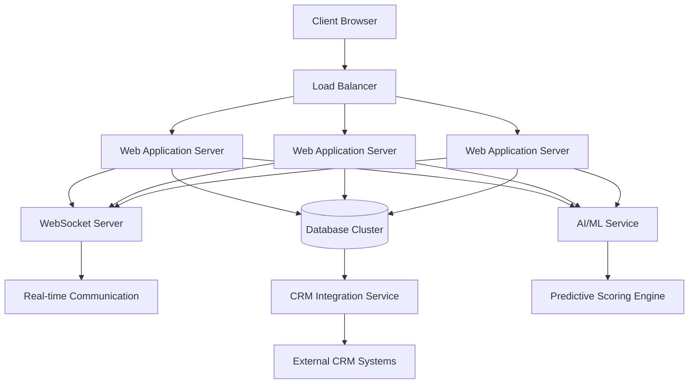

# rulimena.io System Architecture

## Overview
rulimena.io is a smart predictive dialer system designed for call center operations with sales and customer service capabilities. The system includes manual dialer and turbo dialer features, with an admin panel, dashboard, campaign management, and predictive lead scoring.

## High-Level Architecture

## Technology Stack

### Frontend
- **React.js**: Modern UI library for building interactive user interfaces
- **Redux**: State management for complex application data flows
- **WebSocket Client**: For real-time communication with the server
- **Chart.js**: For data visualization in dashboards
- **Material-UI**: Component library for consistent UI design

### Backend
- **Node.js**: JavaScript runtime for building scalable network applications
- **Express.js**: Web application framework for RESTful APIs
- **Socket.IO**: Real-time bidirectional event-based communication
- **Redis**: In-memory data structure store for session management and caching
- **RabbitMQ**: Message broker for handling asynchronous tasks

### Database
- **MongoDB**: NoSQL database for flexible document storage
- **Elasticsearch**: For advanced search and analytics capabilities

### AI/ML Components
- **Python**: For machine learning algorithms
- **TensorFlow/PyTorch**: For building predictive models
- **Scikit-learn**: For traditional machine learning algorithms

### Infrastructure
- **Docker**: Containerization for consistent deployment
- **Kubernetes**: Container orchestration for auto-scaling
- **Nginx**: Reverse proxy and load balancing
- **AWS/GCP**: Cloud infrastructure for deployment

## System Components

### 1. Authentication Service
- User registration and login
- Role-based access control (Admin, Supervisor, Agent)
- Session management with JWT tokens

### 2. Dialer Engine
- **Manual Dialer**: Allows agents to manually dial numbers
- **Turbo Dialer**: Automatically dials numbers from a queue
- **Predictive Dialer**: Uses algorithms to predict optimal dialing times

### 3. Real-time Communication
- WebSocket connections for live agent status updates
- Call monitoring and recording
- Real-time dashboard updates

### 4. Campaign Management
- Campaign creation and scheduling
- Contact list management
- Automated upload of contact data
- Performance tracking and analytics

### 5. Predictive Lead Scoring
- Machine learning models to score leads
- Behavioral analysis of customer interactions
- Dynamic scoring updates based on campaign performance

### 6. CRM Integration
- RESTful APIs for connecting with external CRM systems
- Data synchronization between rulimena.io and CRM
- Custom field mapping

### 7. Admin Panel
- Dashboard with real-time metrics
- User and role management
- System configuration
- Reporting and analytics

## Data Flow

1. **User Authentication**: Users log in through the authentication service
2. **Dashboard Loading**: Real-time data is fetched and displayed
3. **Campaign Management**: Admins create campaigns and upload contact lists
4. **Dialer Operation**: Agents use manual, turbo, or predictive dialing modes
5. **Call Processing**: Calls are processed with real-time monitoring
6. **Data Analysis**: Call data is analyzed for predictive scoring
7. **CRM Sync**: Data is synchronized with external CRM systems
8. **Reporting**: Analytics are generated and displayed in dashboards

## Scalability Considerations

- **Horizontal Scaling**: Multiple application servers behind a load balancer
- **Database Sharding**: Distributing data across multiple database instances
- **Caching**: Using Redis for frequently accessed data
- **Message Queues**: Handling background tasks asynchronously
- **Auto-scaling**: Kubernetes-based scaling based on load metrics

## Security Measures

- HTTPS encryption for all communications
- JWT-based authentication with expiration
- Role-based access control
- Input validation and sanitization
- Regular security audits and updates