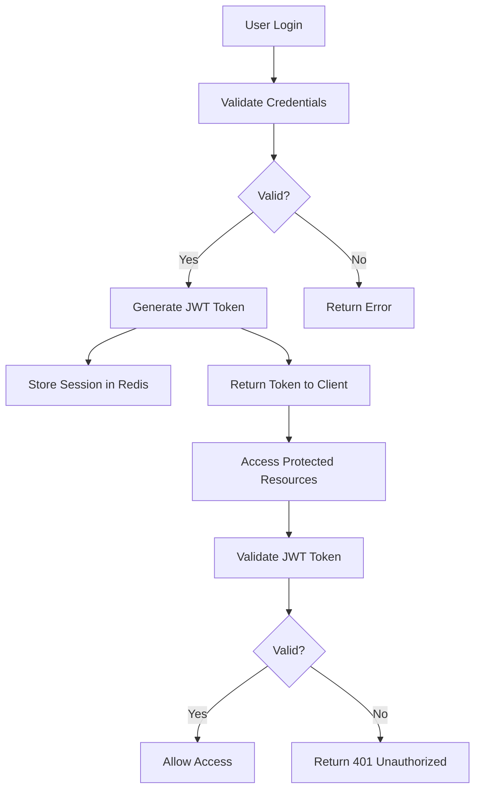

# rulimena.io Authentication and Authorization System

## Overview
This document outlines the authentication and authorization system for rulimena.io, a smart predictive dialer system. The system implements secure user authentication, role-based access control, and session management to protect sensitive customer data and ensure appropriate access levels.

## Authentication Flow



## Technology Stack

- **JWT (JSON Web Tokens)**: For stateless authentication
- **bcrypt**: For password hashing
- **Redis**: For session storage and token blacklisting
- **Passport.js**: For authentication middleware
- **OAuth 2.0**: For third-party integrations (future enhancement)

## User Roles and Permissions

### Role Hierarchy
1. **Admin**: Full system access
2. **Supervisor**: Access to team data and reports
3. **Agent**: Access to dialer functions and own data

### Permission Matrix

| Feature | Admin | Supervisor | Agent |
|---------|-------|------------|-------|
| User Management | ✓ | ✗ | ✗ |
| Campaign Creation | ✓ | ✓ | ✗ |
| Campaign Editing | ✓ | ✓ | ✗ |
| Contact Import | ✓ | ✓ | ✗ |
| Call Monitoring | ✓ | ✓ | ✓ (own calls) |
| Call Recording Access | ✓ | ✓ | ✓ (own calls) |
| Reporting | ✓ | ✓ | ✓ (own metrics) |
| System Settings | ✓ | ✗ | ✗ |
| Agent Performance View | ✓ | ✓ | ✓ (own stats) |

## API Endpoints

### Authentication Endpoints

#### POST /api/auth/register
Registers a new user account.

**Request Body:**
```json
{
  "username": "string",
  "email": "string",
  "password": "string",
  "firstName": "string",
  "lastName": "string",
  "phoneNumber": "string"
}
```

**Response:**
```json
{
  "success": true,
  "message": "User registered successfully",
  "data": {
    "userId": "string",
    "username": "string",
    "email": "string",
    "role": "string"
  }
}
```

#### POST /api/auth/login
Authenticates a user and returns a JWT token.

**Request Body:**
```json
{
  "username": "string",
  "password": "string"
}
```

**Response:**
```json
{
  "success": true,
  "message": "Login successful",
  "data": {
    "token": "string",
    "user": {
      "id": "string",
      "username": "string",
      "email": "string",
      "role": "string",
      "firstName": "string",
      "lastName": "string"
    }
  }
}
```

#### POST /api/auth/logout
Invalidates user session.

**Request Body:**
```json
{
  "token": "string"
}
```

**Response:**
```json
{
  "success": true,
  "message": "Logout successful"
}
```

#### POST /api/auth/forgot-password
Initiates password reset process.

**Request Body:**
```json
{
  "email": "string"
}
```

**Response:**
```json
{
  "success": true,
  "message": "Password reset email sent"
}
```

#### POST /api/auth/reset-password
Resets user password using token.

**Request Body:**
```json
{
  "token": "string",
  "newPassword": "string"
}
```

**Response:**
```json
{
  "success": true,
  "message": "Password reset successful"
}
```

## Security Measures

### Password Security
- **bcrypt**: Passwords are hashed with bcrypt (12 rounds)
- **Strength Requirements**: Minimum 8 characters, mixed case, numbers, and special characters
- **Rate Limiting**: Account lockout after 5 failed attempts

### Token Management
- **JWT Expiration**: Tokens expire after 24 hours
- **Refresh Tokens**: Long-lived tokens for seamless user experience
- **Token Blacklisting**: Revoked tokens stored in Redis until expiration

### Session Management
- **Redis Storage**: Active sessions stored in Redis with TTL
- **Concurrent Sessions**: Limit of 3 active sessions per user
- **Session Monitoring**: Admins can view and terminate user sessions

## Authorization Middleware

### Role-Based Access Control
Middleware functions to check user roles before allowing access to specific routes:

```javascript
// Admin only middleware
const requireAdmin = (req, res, next) => {
  if (req.user.role !== 'admin') {
    return res.status(403).json({
      success: false,
      message: 'Access denied. Admin privileges required.'
    });
  }
  next();
};

// Supervisor or Admin middleware
const requireSupervisorOrAdmin = (req, res, next) => {
  if (req.user.role !== 'admin' && req.user.role !== 'supervisor') {
    return res.status(403).json({
      success: false,
      message: 'Access denied. Supervisor or admin privileges required.'
    });
  }
  next();
};

// Agent middleware
const requireAgent = (req, res, next) => {
  if (!req.user.role) {
    return res.status(403).json({
      success: false,
      message: 'Access denied. Authentication required.'
    });
  }
  next();
};
```

## Data Protection

### Encryption
- **Data at Rest**: MongoDB encryption at rest
- **Data in Transit**: TLS 1.3 for all communications
- **Sensitive Fields**: Additional encryption for phone numbers and personal data

### Privacy Compliance
- **GDPR**: Data anonymization and deletion capabilities
- **CCPA**: Consumer data privacy controls
- **Audit Logs**: Comprehensive logging of all authentication events

## Implementation Details

### User Registration Process
1. Validate input data
2. Check for existing username/email
3. Hash password with bcrypt
4. Generate email verification token
5. Send verification email
6. Store user data in database
7. Return success response

### User Login Process
1. Validate input credentials
2. Retrieve user from database
3. Compare password hash
4. Generate JWT token
5. Store session in Redis
6. Return token and user data

### Password Reset Process
1. Validate email address
2. Generate password reset token
3. Store token with expiration (1 hour)
4. Send reset email with token
5. Validate token when used
6. Update password after validation

## API Security

### Rate Limiting
- **Authentication Endpoints**: 10 requests per minute
- **General API**: 1000 requests per hour per user
- **Admin API**: 500 requests per hour per user

### CORS Configuration
- **Allowed Origins**: Configurable per environment
- **Allowed Methods**: GET, POST, PUT, DELETE, OPTIONS
- **Allowed Headers**: Content-Type, Authorization, X-Requested-With

### Input Validation
- **Joi Validation**: Schema validation for all API inputs
- **Sanitization**: Removal of potentially harmful characters
- **Length Limits**: Maximum field lengths enforced

## Monitoring and Logging

### Authentication Events
- Successful logins
- Failed login attempts
- Password resets
- Account lockouts
- Session terminations

### Audit Trail
- User actions logged with timestamps
- IP address tracking
- User agent information
- Geolocation data (optional)

## Future Enhancements

### Multi-Factor Authentication
- **TOTP**: Time-based one-time passwords
- **SMS**: SMS-based verification codes
- **Email**: Email-based verification codes

### Single Sign-On
- **SAML**: Integration with enterprise identity providers
- **OAuth**: Integration with Google, Microsoft, etc.

### Biometric Authentication
- **Fingerprint**: Fingerprint-based authentication
- **Face Recognition**: Facial recognition for secure access