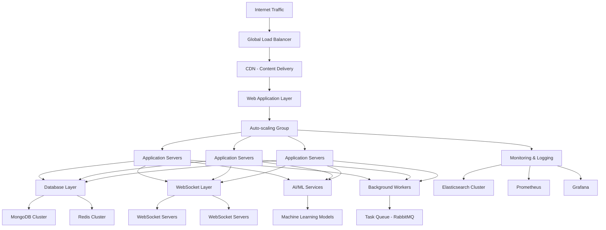

# rulimena.io Cloud Deployment with Auto-scaling

## Overview
This document outlines the cloud deployment architecture for rulimena.io with auto-scaling capabilities to handle variable call volumes efficiently while maintaining high availability and performance.

## Cloud Infrastructure Architecture

### High-Level Architecture

### Infrastructure Components

#### Compute Resources
- **Application Servers**: Node.js application instances
- **WebSocket Servers**: Real-time communication servers
- **AI/ML Services**: Python-based machine learning services
- **Background Workers**: Task processing services
- **Load Balancers**: Traffic distribution

#### Data Storage
- **MongoDB Cluster**: Primary database with replication
- **Redis Cluster**: In-memory cache and session store
- **Elasticsearch Cluster**: Search and analytics engine
- **Object Storage**: File storage for recordings and logs

#### Networking
- **Virtual Private Cloud (VPC)**: Isolated network environment
- **Subnets**: Segmented network zones
- **Security Groups**: Firewall rules
- **Content Delivery Network (CDN)**: Global content caching

## Auto-scaling Strategies

### Horizontal Scaling

#### Application Server Scaling
- **Metric-based Scaling**: CPU utilization, memory usage, request latency
- **Predictive Scaling**: Machine learning-based demand forecasting
- **Scheduled Scaling**: Predefined scaling for predictable traffic patterns
- **Step Scaling**: Incremental instance addition/removal

#### WebSocket Server Scaling
- **Connection-based Scaling**: Scale based on active WebSocket connections
- **Message Throughput**: Scale based on message processing volume
- **Geographic Distribution**: Regional scaling for global users

#### Database Scaling
- **Read Replicas**: Horizontal scaling for read operations
- **Sharding**: Data distribution across multiple instances
- **Caching Layers**: Redis for reducing database load

### Vertical Scaling
- **Instance Type Upgrades**: CPU/memory upgrades for performance
- **Storage Scaling**: Dynamic storage allocation
- **Network Bandwidth**: Bandwidth scaling for high-traffic periods

### Scaling Policies

#### Scale-out Triggers
- CPU utilization > 70% for 5 minutes
- Memory usage > 80% for 5 minutes
- Request queue length > 100 for 2 minutes
- WebSocket connections > 80% of instance capacity

#### Scale-in Triggers
- CPU utilization < 30% for 10 minutes
- Memory usage < 40% for 10 minutes
- Request queue length < 20 for 5 minutes
- WebSocket connections < 30% of instance capacity

## Deployment Pipelines

### CI/CD Pipeline

#### Development Workflow
1. **Code Commit**: Developers push code to version control
2. **Automated Testing**: Unit, integration, and functional tests
3. **Code Quality Checks**: Linting, security scanning
4. **Build Process**: Container image creation
5. **Staging Deployment**: Deploy to staging environment
6. **Automated Validation**: Smoke tests and health checks
7. **Production Deployment**: Gradual rollout to production

#### Deployment Strategies
- **Blue-Green Deployment**: Zero-downtime deployments
- **Rolling Updates**: Gradual instance replacement
- **Canary Releases**: Gradual user traffic shifting
- **Feature Flags**: Runtime feature toggling

### Environment Management

#### Development Environment
- Isolated development instances
- Feature branch deployments
- Developer self-service provisioning
- Integrated debugging tools

#### Staging Environment
- Production-like configuration
- Comprehensive testing capabilities
- Performance benchmarking
- User acceptance testing

#### Production Environment
- High availability configuration
- Monitoring and alerting
- Disaster recovery setup
- Security compliance

## Containerization Strategy

### Docker Implementation

#### Application Containers
- **Web Application**: Node.js application container
- **WebSocket Server**: Real-time communication container
- **AI/ML Service**: Python-based ML service container
- **Background Worker**: Task processing container
- **Database Proxy**: Connection pooling and management

#### Container Orchestration
- **Kubernetes**: Container orchestration platform
- **Helm Charts**: Application deployment templates
- **Namespace Isolation**: Environment separation
- **Resource Quotas**: Resource allocation limits

### Image Management
- **Base Images**: Standardized base images for security
- **Image Scanning**: Vulnerability scanning for images
- **Version Tagging**: Semantic versioning for images
- **Registry Management**: Private image registry

## Monitoring and Alerting

### System Monitoring

#### Infrastructure Metrics
- **CPU Utilization**: Processing power usage
- **Memory Usage**: RAM consumption
- **Disk I/O**: Storage read/write operations
- **Network Traffic**: Bandwidth utilization
- **Instance Health**: Overall system status

#### Application Metrics
- **Response Time**: API response latency
- **Error Rates**: HTTP error frequency
- **Throughput**: Requests per second
- **Database Performance**: Query execution times
- **WebSocket Performance**: Connection latency

#### Business Metrics
- **Call Volume**: Number of calls processed
- **Conversion Rates**: Successful call outcomes
- **Agent Performance**: Agent productivity metrics
- **System Availability**: Uptime percentage
- **User Engagement**: Active user sessions

### Logging Architecture

#### Log Collection
- **Application Logs**: Custom application logging
- **System Logs**: Operating system events
- **Security Logs**: Authentication and access events
- **Audit Logs**: User action tracking
- **Performance Logs**: Detailed performance data

#### Log Processing
- **Centralized Logging**: Unified log aggregation
- **Real-time Processing**: Stream processing for alerts
- **Log Retention**: Configurable retention policies
- **Log Archiving**: Long-term storage solutions

### Alerting System

#### Alert Categories
- **Critical Alerts**: System downtime, data loss
- **Warning Alerts**: Performance degradation, high error rates
- **Informational Alerts**: System events, maintenance windows
- **Business Alerts**: Conversion drops, call volume changes

#### Notification Channels
- **Email Notifications**: Detailed alert emails
- **SMS Alerts**: Critical alert text messages
- **Slack Integration**: Real-time team notifications
- **PagerDuty**: Escalation management
- **Webhooks**: Custom integration endpoints

## Security Considerations

### Network Security

#### Firewall Configuration
- **Security Groups**: Instance-level firewall rules
- **Network ACLs**: Subnet-level access control
- **DDoS Protection**: Distributed denial-of-service mitigation
- **Intrusion Detection**: Network-based threat detection

#### Encryption
- **Data in Transit**: TLS 1.3 encryption
- **Data at Rest**: Database and file encryption
- **Key Management**: Centralized key management service
- **Certificate Management**: SSL/TLS certificate handling

### Identity and Access Management

#### User Authentication
- **Multi-factor Authentication**: Enhanced login security
- **Single Sign-On**: Enterprise authentication integration
- **Role-based Access**: Granular permission control
- **Session Management**: Secure session handling

#### Service Authentication
- **Service Accounts**: Application-to-application authentication
- **API Keys**: Programmatic access control
- **Certificate-based Auth**: Mutual TLS authentication
- **Token Management**: JWT and OAuth token handling

### Compliance and Auditing

#### Regulatory Compliance
- **GDPR**: Data privacy compliance
- **CCPA**: Consumer privacy protection
- **HIPAA**: Healthcare data protection (if applicable)
- **PCI DSS**: Payment card industry compliance (if applicable)

#### Audit Trails
- **User Activity Logging**: Comprehensive user action tracking
- **System Changes**: Configuration change logging
- **Data Access**: Sensitive data access monitoring
- **Compliance Reporting**: Automated compliance reports

## Cost Optimization

### Resource Optimization

#### Right-sizing
- **Instance Selection**: Appropriate instance types
- **Auto-scaling Boundaries**: Optimal scaling limits
- **Reserved Instances**: Committed usage discounts
- **Spot Instances**: Cost-effective compute options

#### Storage Optimization
- **Data Tiering**: Hot/warm/cold data storage
- **Compression**: Data compression techniques
- **Deduplication**: Duplicate data elimination
- **Archiving**: Long-term data archiving

### Cost Monitoring

#### Cost Allocation
- **Tagging Strategy**: Resource tagging for cost tracking
- **Budget Alerts**: Spending threshold notifications
- **Cost Analysis**: Detailed cost breakdowns
- **Optimization Recommendations**: Cost-saving suggestions

#### Billing Management
- **Consolidated Billing**: Multi-account billing
- **Reserved Instance Utilization**: Reservation optimization
- **Savings Plans**: Committed usage discounts
- **Cost Anomaly Detection**: Unexpected spending alerts

## Disaster Recovery

### Backup Strategy

#### Data Backup
- **Automated Backups**: Scheduled database backups
- **Point-in-time Recovery**: Granular recovery options
- **Cross-region Replication**: Geographic redundancy
- **Backup Validation**: Regular backup testing

#### Application Backup
- **Configuration Backup**: Application configuration storage
- **Code Repository**: Version-controlled source code
- **Container Images**: Registry-based image storage
- **Infrastructure as Code**: Deployable infrastructure templates

### Recovery Procedures

#### Recovery Time Objectives (RTO)
- **Critical Systems**: < 30 minutes recovery time
- **Important Systems**: < 2 hours recovery time
- **Standard Systems**: < 8 hours recovery time

#### Recovery Point Objectives (RPO)
- **Critical Data**: < 5 minutes data loss
- **Important Data**: < 1 hour data loss
- **Standard Data**: < 24 hours data loss

## Performance Optimization

### Caching Strategy

#### Application Caching
- **Redis Clustering**: Distributed cache implementation
- **Cache Invalidation**: Intelligent cache update strategies
- **Cache Warming**: Pre-population of frequently accessed data
- **Multi-level Caching**: Tiered caching approach

#### Content Delivery
- **CDN Integration**: Global content caching
- **Static Asset Optimization**: Image and file optimization
- **Edge Computing**: Geographically distributed processing
- **Compression**: Gzip and Brotli compression

### Database Optimization

#### Query Optimization
- **Indexing Strategy**: Performance-enhancing indexes
- **Query Analysis**: Slow query identification
- **Connection Pooling**: Efficient database connections
- **Read Replicas**: Scalable read operations

#### Data Modeling
- **Schema Design**: Efficient data structures
- **Normalization/Denormalization**: Balanced data organization
- **Partitioning**: Large data set management
- **Archiving**: Historical data management

## Testing and Validation

### Performance Testing

#### Load Testing
- **Simulated User Traffic**: Realistic usage patterns
- **Stress Testing**: Maximum capacity validation
- **Soak Testing**: Long-term stability verification
- **Spike Testing**: Sudden traffic surge handling

#### Scalability Testing
- **Horizontal Scaling Validation**: Multi-instance performance
- **Vertical Scaling Validation**: Resource upgrade testing
- **Auto-scaling Trigger Testing**: Scaling policy validation
- **Geographic Distribution Testing**: Multi-region performance

### Security Testing

#### Vulnerability Assessment
- **Penetration Testing**: Security weakness identification
- **Code Scanning**: Static application security testing
- **Dependency Scanning**: Third-party library vulnerabilities
- **Configuration Auditing**: Security configuration review

#### Compliance Testing
- **Regulatory Compliance**: GDPR, CCPA validation
- **Industry Standards**: ISO, SOC compliance verification
- **Data Privacy**: Privacy policy enforcement
- **Access Control**: Permission validation

## Future Enhancements

### Advanced Scaling Technologies

#### Machine Learning-based Scaling
- **Predictive Scaling**: AI-driven capacity planning
- **Anomaly Detection**: Unusual pattern identification
- **Self-healing Systems**: Automated issue resolution
- **Performance Optimization**: Continuous system tuning

#### Serverless Integration
- **Function-as-a-Service**: Event-driven computing
- **Microservices Architecture**: Granular service deployment
- **Event Streaming**: Real-time data processing
- **Edge Computing**: Distributed processing capabilities

### Multi-cloud Strategy
- **Cloud Agnostic Design**: Vendor-neutral architecture
- **Hybrid Cloud**: On-premise and cloud integration
- **Cloud Bursting**: Dynamic cloud resource allocation
- **Disaster Recovery**: Multi-cloud redundancy