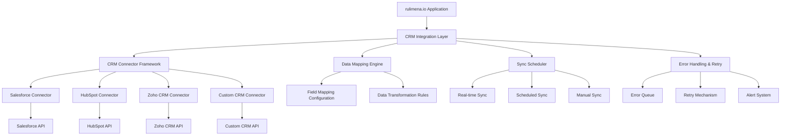

# rulimena.io CRM Integration Capabilities

## Overview
This document outlines the CRM integration capabilities for rulimena.io, enabling seamless data flow between the predictive dialer system and various CRM platforms to ensure consistent customer information and improved sales processes.

## Integration Architecture

### System Architecture



### Integration Layer Components

#### CRM Connector Framework
- Pluggable architecture for different CRM systems
- Standardized interface for all connectors
- Authentication management
- Rate limiting and throttling

#### Data Mapping Engine
- Field mapping configuration
- Data transformation rules
- Validation and cleansing
- Conflict resolution strategies

#### Sync Scheduler
- Real-time synchronization triggers
- Scheduled synchronization jobs
- Manual synchronization options
- Sync frequency configuration

#### Error Handling & Recovery
- Error detection and logging
- Automatic retry mechanisms
- Alerting for critical failures
- Manual intervention workflows

## Data Synchronization Mechanisms

### Bidirectional Data Flow

#### Contact Synchronization
- **Import from CRM**: Bring contacts into rulimena.io
- **Export to CRM**: Send updated contact information to CRM
- **Conflict Resolution**: Handle data conflicts between systems
- **Delta Sync**: Only sync changed records for efficiency

#### Call Data Synchronization
- **Call Logs to CRM**: Send call details to CRM
- **Call Dispositions**: Update CRM with call outcomes
- **Activity Tracking**: Record call activities in CRM
- **Notes Integration**: Sync agent notes with CRM

#### Campaign Data Synchronization
- **Campaign Status**: Update CRM with campaign progress
- **Lead Status**: Sync lead status changes
- **Conversion Tracking**: Report conversions to CRM
- **Performance Metrics**: Share campaign metrics with CRM

### Synchronization Models

#### Real-time Synchronization
- Webhook-based triggers for immediate updates
- Low-latency data transfer
- Event-driven architecture
- Best for critical data updates

#### Scheduled Synchronization
- Configurable sync intervals (hourly, daily, weekly)
- Batch processing for efficiency
- Resource optimization
- Best for non-critical data updates

#### Manual Synchronization
- User-initiated sync operations
- On-demand data refresh
- Conflict resolution interface
- Best for initial setup or troubleshooting

## API Design for CRM Connectivity

### Authentication API

#### POST /api/crm/auth/connect
Establishes connection with CRM system.

**Request Body:**
```json
{
  "crmType": "string",
  "credentials": {
    "clientId": "string",
    "clientSecret": "string",
    "accessToken": "string",
    "refreshToken": "string"
  },
  "instanceUrl": "string"
}
```

**Response:**
```json
{
  "success": true,
  "data": {
    "connectionId": "string",
    "status": "connected",
    "crmType": "string"
  }
}
```

#### POST /api/crm/auth/refresh
Refreshes authentication tokens.

**Request Body:**
```json
{
  "connectionId": "string"
}
```

**Response:**
```json
{
  "success": true,
  "data": {
    "accessToken": "string",
    "expiresIn": "number"
  }
}
```

### Data Synchronization API

#### POST /api/crm/sync/contacts/import
Imports contacts from CRM to rulimena.io.

**Request Body:**
```json
{
  "connectionId": "string",
  "filters": {
    "modifiedAfter": "date",
    "tags": ["string"],
    "status": "string"
  },
  "mapping": {
    "sourceField": "destinationField"
  }
}
```

**Response:**
```json
{
  "success": true,
  "data": {
    "importId": "string",
    "totalRecords": "number",
    "processedRecords": "number"
  }
}
```

#### POST /api/crm/sync/contacts/export
Exports contacts from rulimena.io to CRM.

**Request Body:**
```json
{
  "connectionId": "string",
  "contactIds": ["string"],
  "mapping": {
    "sourceField": "destinationField"
  }
}
```

**Response:**
```json
{
  "success": true,
  "data": {
    "exportId": "string",
    "totalRecords": "number",
    "successCount": "number",
    "errorCount": "number"
  }
}
```

#### POST /api/crm/sync/calls/log
Logs call data to CRM.

**Request Body:**
```json
{
  "connectionId": "string",
  "callData": {
    "contactId": "string",
    "callId": "string",
    "startTime": "date",
    "endTime": "date",
    "duration": "number",
    "disposition": "string",
    "notes": "string",
    "recordingUrl": "string"
  }
}
```

**Response:**
```json
{
  "success": true,
  "data": {
    "crmCallId": "string",
    "status": "logged"
  }
}
```

### Configuration API

#### GET /api/crm/config/mapping/{connectionId}
Retrieves field mapping configuration.

#### POST /api/crm/config/mapping
Updates field mapping configuration.

#### GET /api/crm/config/sync/{connectionId}
Retrieves synchronization settings.

#### PUT /api/crm/config/sync/{connectionId}
Updates synchronization settings.

## Supported CRM Platforms

### Salesforce Integration

#### Features
- OAuth 2.0 authentication
- REST API connectivity
- Real-time webhook support
- Bulk data operations
- Custom object