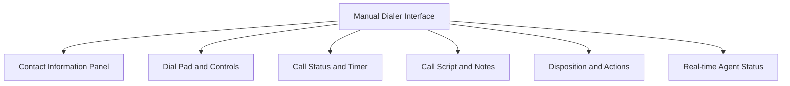
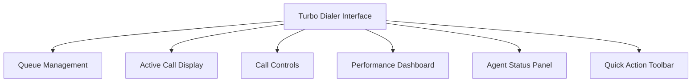

# rulimena.io Manual and Turbo Dialer Interfaces

## Overview
This document outlines the design for the manual and turbo dialer interfaces in rulimena.io, providing agents with intuitive tools for efficient call handling and customer engagement.

## Manual Dialer Interface

### Interface Layout

### Contact Information Panel

#### Key Components
- **Contact Name**: Primary contact identifier
- **Phone Numbers**: Multiple numbers with type labels
- **Company Information**: Company name and position
- **Demographics**: Age, location, income level
- **Lead Score**: Predictive score with factors
- **Call History**: Previous interactions summary
- **Custom Fields**: CRM-specific data fields

#### Interaction Features
- Click-to-dial for any phone number
- Quick view of contact details
- Expandable sections for detailed information
- Edit contact information directly
- Flag important contacts

### Dial Pad and Controls

#### Core Dialing Features
- **Numeric Keypad**: Standard phone dial pad
- **Dial Button**: Large, prominent call initiation
- **Hang Up Button**: Emergency call termination
- **Mute Toggle**: Microphone mute control
- **Hold Function**: Call hold with music
- **Transfer Options**: Call transfer capabilities
- **Conference Call**: Multi-party calling

#### Advanced Controls
- **Speed Dial**: Quick access to frequent numbers
- **Callback Scheduler**: Schedule future calls
- **Voicemail Drop**: Leave voicemail without connecting
- **Call Recording**: Manual recording activation
- **Pause/Resume**: Temporary call flow control

### Call Status and Timer

#### Real-time Call Information
- **Call Timer**: Elapsed time display
- **Connection Status**: Ringing/Connected/Ended
- **Caller ID**: Verified caller information
- **Call Quality Indicator**: Audio quality feedback
- **Call Recording Status**: Recording indicator

#### Call Progress Tracking
- **Call Flow Visualization**: Step-by-step call progress
- **Agent Performance Metrics**: Real-time stats
- **System Alerts**: Important notifications
- **Emergency Procedures**: Quick access to help

### Call Script and Notes

#### Script Presentation
- **Script Templates**: Pre-defined conversation guides
- **Dynamic Placeholders**: Personalized script elements
- **Compliance Reminders**: Regulatory requirement prompts
- **Product Information**: Quick access to product details
- **FAQ Integration**: Common question responses

#### Note Taking Features
- **Real-time Note Capture**: Type during calls
- **Template-based Notes**: Standardized note formats
- **Voice-to-Text**: Speech recognition for notes
- **Tagging System**: Categorize notes for search
- **Auto-save**: Automatic note preservation

### Disposition and Actions

#### Call Outcome Recording
- **Predefined Dispositions**: Standardized outcome options
- **Custom Disposition Codes**: User-defined outcomes
- **Follow-up Scheduling**: Automatic next-contact scheduling
- **Task Creation**: Generate follow-up tasks
- **CRM Integration**: Direct CRM updates

#### Post-call Actions
- **Contact Status Update**: Modify contact lifecycle stage
- **Score Adjustment**: Manual lead score overrides
- **Tag Management**: Add/remove contact tags
- **Document Attachment**: Link files to contact record
- **Referral Capture**: Record new contact referrals

## Turbo Dialer Interface

### Interface Layout

### Queue Management

#### Call Queue Visualization
- **Queue Position**: Agent's position in dialing queue
- **Queue Size**: Total calls in queue
- **Priority Indicators**: High-priority call highlighting
- **Wait Time Estimates**: Predicted wait times
- **Queue Statistics**: Real-time queue metrics

#### Queue Control Features
- **Queue Pause**: Temporarily stop receiving calls
- **Queue Priority Adjustment**: Modify call priority
- **Manual Queue Selection**: Choose specific queues
- **Queue Assignment**: Team-based queue distribution
- **Overflow Management**: Handle overflow calls

### Active Call Display

#### Current Call Information
- **Contact Preview**: Brief contact information
- **Call Reason**: Purpose of the call
- **Script Snippet**: Key talking points
- **Historical Context**: Previous interaction summary
- **Personalization Data**: Relevant customer information

#### Call Progress Indicators
- **Connection Status**: Dialing/Connected/Ended
- **Call Timer**: Elapsed time display
- **Call Outcome Prediction**: AI-predicted outcome
- **Quality Assurance**: Call quality metrics
- **Compliance Monitoring**: Regulatory adherence

### Call Controls

#### Turbo Dialing Features
- **Auto-dial Toggle**: Enable/disable automatic dialing
- **Call Acceptance**: Accept/reject incoming calls
- **Quick Disposition**: Fast outcome recording
- **One-click Transfer**: Immediate call transfer
- **Voicemail Detection**: Automatic voicemail handling

#### Advanced Controls
- **Predictive Dialing Settings**: Adjust dialing ratios
- **Call Distribution**: Control call allocation
- **Agent Matching**: Skill-based call routing
- **Emergency Stop**: Immediate dialing cessation
- **Performance Optimization**: Real-time adjustments

### Performance Dashboard

#### Real-time Metrics
- **Calls per Hour**: Current call volume
- **Connection Rate**: Percentage of answered calls
- **Conversion Rate**: Success metrics
- **Average Handle Time**: Call duration statistics
- **Agent Utilization**: Time spent on calls

#### Performance Tracking
- **Goal Progress**: Daily/weekly target tracking
- **Rankings**: Performance comparisons
- **Achievements**: Milestone recognition
- **Improvement Suggestions**: Personalized tips
- **Historical Trends**: Performance over time

### Agent Status Panel

#### Current Status
- **Availability**: Current agent status
- **Break Timer**: Remaining break time
- **Next Shift**: Upcoming schedule information
- **Performance Rating**: Current performance score
- **System Alerts**: Important notifications

#### Status Management
- **Status Quick Change**: One-click status updates
- **Break Request**: Request scheduled breaks
- **Training Mode**: Enter training session
- **Help Request**: Request supervisor assistance
- **Away Status**: Set temporary unavailability

### Quick Action Toolbar

#### Common Actions
- **New Contact**: Create contact manually
- **Import Contacts**: Bulk contact import
- **Search Contacts**: Quick contact search
- **Reports**: Access performance reports
- **Settings**: Adjust dialer preferences

#### Shortcuts
- **Keyboard Shortcuts**: Accelerated workflows
- **Custom Macros**: Personalized action sequences
- **Template Access**: Quick script/template access
- **Help Resources**: Access support materials
- **Feedback Submission**: Report issues/suggestions

## Real-time Status Updates

### Agent Status Tracking

#### Status Indicators
- **Available**: Ready for calls
- **On Call**: Currently in a call
- **Break**: On scheduled break
- **Lunch**: On lunch break
- **Training**: In training session
- **Offline**: Not available
- **Wrap-up**: Completing post-call tasks

#### Status History
- **Status Timeline**: Historical status changes
- **Duration Tracking**: Time in each status
- **Availability Analysis**: Productive time metrics
- **Pattern Recognition**: Identify trends

### Call Status Updates

#### Real-time Call Information
- **Call Progress**: Dialing/connected/disconnected
- **Call Quality**: Audio quality indicators
- **System Status**: Infrastructure health
- **Queue Position**: Current position in dialing queue
- **Performance Metrics**: Real-time stats

#### Notification System
- **Visual Alerts**: Color-coded status indicators
- **Audio Notifications**: Sound-based alerts
- **Desktop Notifications**: System-level notifications
- **Priority Alerts**: Critical event notifications
- **Customizable Alerts**: User-defined notification preferences

## Call Control Features

### Call Management Tools

#### Basic Controls
- **Call Initiation**: Start calls manually or automatically
- **Call Termination**: End calls gracefully
- **Call Hold**: Temporarily pause calls
- **Call Transfer**: Redirect calls to other agents
- **Call Conference**: Multi-party calling

#### Advanced Features
- **Call Recording**: Automatic/manual recording
- **Voicemail Detection**: Identify voicemail systems
- **Call Screening**: Pre-call contact verification
- **Callback Requests**: Schedule future calls
- **Emergency Procedures**: Critical situation handling

### Productivity Enhancements

#### Time-saving Features
- **One-click Actions**: Streamlined workflows
- **Keyboard Shortcuts**: Accelerated operations
- **Auto-fill Forms**: Pre-populate information
- **Smart Suggestions**: Context-aware recommendations
- **Batch Operations**: Process multiple items

#### Quality Assurance
- **Script Compliance**: Ensure adherence to scripts
- **Call Monitoring**: Supervisor oversight
- **Performance Analytics**: Track agent metrics
- **Training Recommendations**: Skill improvement suggestions
- **Feedback Integration**: Continuous improvement

## User Experience Design

### Interface Principles

#### Simplicity
- **Clean Layout**: Uncluttered interface design
- **Intuitive Navigation**: Easy-to-use controls
- **Consistent Design**: Standardized UI elements
- **Minimal Learning Curve**: Quick adoption

#### Efficiency
- **Task Optimization**: Streamlined workflows
- **Reduced Clicks**: Minimize user actions
- **Smart Defaults**: Appropriate default settings
- **Contextual Help**: In-app guidance

#### Accessibility
- **Keyboard Navigation**: Full keyboard support
- **Screen Reader Compatibility**: Assistive technology support
- **High Contrast Mode**: Enhanced visibility
- **Customizable Interface**: Personalization options

### Responsive Design

#### Multi-device Support
- **Desktop Optimization**: Full-featured interface
- **Tablet Compatibility**: Touch-optimized controls
- **Mobile Responsiveness**: Simplified mobile interface
- **Cross-browser Support**: Consistent experience

#### Adaptive Features
- **Screen Size Adaptation**: Layout adjustments
- **Touch Gesture Support**: Mobile-friendly interactions
- **Orientation Handling**: Portrait/landscape support
- **Performance Optimization**: Fast loading times

## Integration with System Features

### CRM Integration
- **Real-time Data Sync**: Instant CRM updates
- **Contact Enrichment**: Additional data display
- **Activity Tracking**: Call logging to CRM
- **Task Management**: CRM task synchronization

### Predictive Scoring
- **Score Display**: Lead score visibility
- **Scoring Factors**: Reason for scores
- **Score Updates**: Real-time score changes
- **Scoring Insights**: Performance analysis

### Campaign Management
- **Campaign Context**: Relevant campaign information
- **Script Customization**: Campaign-specific scripts
- **Performance Tracking**: Campaign metrics
- **Queue Management**: Campaign-based queues

## Security and Compliance

### Data Protection
- **Encryption**: Secure data transmission
- **Access Controls**: Role-based permissions
- **Audit Trails**: Activity logging
- **Data Privacy**: Compliance with regulations

### Regulatory Compliance
- **Do-not-call Compliance**: Respecting preferences
- **Call Recording Compliance**: Legal requirements
- **Data Retention**: Appropriate data storage
- **Consent Management**: User consent tracking

## Testing and Quality Assurance

### User Interface Testing
- **Usability Testing**: User experience validation
- **Accessibility Testing**: Compliance verification
- **Cross-browser Testing**: Compatibility assurance
- **Performance Testing**: Speed and responsiveness

### Functional Testing
- **Feature Validation**: All features working correctly
- **Integration Testing**: Seamless system integration
- **Error Handling**: Graceful error management
- **Recovery Testing**: System recovery validation

## Future Enhancements

### AI-Powered Features
- **Voice Analytics**: Speech pattern analysis
- **Sentiment Detection**: Emotional tone recognition
- **Predictive Suggestions**: AI-driven recommendations
- **Automated Note-taking**: Voice-to-text conversion

### Advanced Visualization
- **3D Data Representation**: Immersive data visualization
- **Augmented Reality**: AR-enhanced interfaces
- **Voice Control**: Voice-activated controls
- **Gesture Recognition**: Motion-based interactions

### Collaboration Features
- **Team Communication**: Integrated messaging
- **Shared Workspaces**: Collaborative environments
- **Real-time Editing**: Simultaneous document editing
- **Video Conferencing**: Integrated video calls