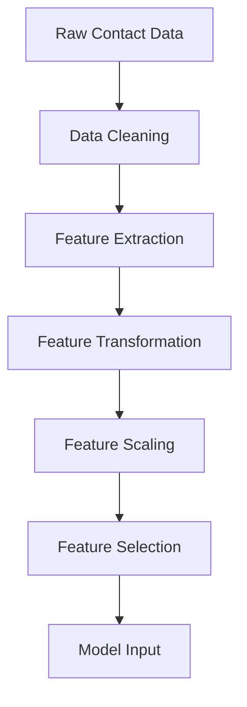

# rulimena.io Predictive Lead Scoring Algorithm

## Overview
This document outlines the design of the predictive lead scoring algorithm for rulimena.io, which determines the likelihood of a contact converting into a customer based on historical data and behavioral patterns.

## Algorithm Approach

### Machine Learning Methodology
- **Primary Algorithm**: Gradient Boosted Decision Trees (XGBoost)
- **Secondary Algorithm**: Random Forest for ensemble methods
- **Neural Network**: Deep learning model for complex pattern recognition
- **Hybrid Approach**: Combination of algorithms for improved accuracy

### Scoring Scale
- **0-100 Scale**: Normalized score where:
  - 0-30: Low probability lead
  - 31-60: Medium probability lead
  - 61-100: High probability lead

## Data Features for Scoring

### Contact Demographics
- Age
- Gender
- Location (city, state, country)
- Income level
- Occupation
- Company size
- Industry

### Behavioral Data
- Previous call interactions
- Response patterns
- Call duration history
- Time of day preferences
- Day of week patterns
- Frequency of contact
- Voicemail detection history

### Campaign Performance
- Conversion rates by campaign type
- Response rates by time period
- Historical lead performance
- Campaign-specific success factors

### External Data Sources
- CRM data integration
- Social media activity (if available)
- Web behavior tracking (if integrated)
- Purchase history (if available)

### Temporal Features
- Days since last contact
- Seasonal trends
- Time since lead creation
- Engagement velocity

## Model Architecture

### Feature Engineering Pipeline



### Model Training Process

1. **Data Preparation**
   - Historical call data extraction
   - Feature vector creation
   - Label assignment (converted/not converted)
   - Data splitting (train/validation/test)

2. **Model Training**
   - XGBoost model training
   - Random Forest model training
   - Neural Network training
   - Hyperparameter optimization

3. **Model Evaluation**
   - Accuracy metrics calculation
   - Precision and recall analysis
   - ROC curve evaluation
   - Cross-validation scores

4. **Model Deployment**
   - Model versioning
   - A/B testing setup
   - Gradual rollout procedures
   - Performance monitoring

## Algorithm Implementation

### XGBoost Model Configuration
```python
{
  "objective": "binary:logistic",
  "eval_metric": "logloss",
  "max_depth": 6,
  "learning_rate": 0.1,
  "subsample": 0.8,
  "colsample_bytree": 0.8,
  "n_estimators": 1000,
  "random_state": 42
}
```

### Feature Importance Calculation
- Automated feature importance ranking
- Regular re-evaluation of feature relevance
- Dynamic feature weighting based on performance

### Scoring Factors Documentation
Each contact's score will be accompanied by:
- Top contributing factors
- Confidence interval
- Model version used
- Last update timestamp

## Model Training and Evaluation

### Training Data Sources
- Historical call logs
- Contact conversion outcomes
- Agent disposition data
- Campaign performance metrics

### Evaluation Metrics
- **Accuracy**: Overall correct predictions
- **Precision**: True positives / (True positives + False positives)
- **Recall**: True positives / (True positives + False negatives)
- **F1 Score**: Harmonic mean of precision and recall
- **AUC-ROC**: Area under the ROC curve

### Cross-Validation Strategy
- 5-fold cross-validation
- Time-based validation splits
- Stratified sampling for balanced datasets

### Model Improvement Process
1. Weekly model retraining
2. Performance threshold monitoring
3. Automatic model rollback for degradation
4. Manual review for significant changes

## Integration with System

### Real-time Scoring API
#### POST /api/scoring/score-contact
Scores a single contact based on current model.

**Request Body:**
```json
{
  "contactId": "string",
  "features": {
    "demographics": {},
    "behavioral": {},
    "campaign": {}
  }
}
```

**Response:**
```json
{
  "success": true,
  "data": {
    "contactId": "string",
    "score": 75,
    "confidence": 0.85,
    "factors": [
      "previous positive response",
      "optimal contact time",
      "high income demographic"
    ],
    "modelVersion": "v1.2.3"
  }
}
```

#### POST /api/scoring/batch-score
Scores multiple contacts in batch.

**Request Body:**
```json
{
  "contactIds": ["string"],
  "campaignId": "string"
}
```

**Response:**
```json
{
  "success": true,
  "data": [
    {
      "contactId": "string",
      "score": 75,
      "confidence": 0.85
    }
  ]
}
```

### Model Management API
#### GET /api/scoring/models
Retrieves list of available scoring models.

#### POST /api/scoring/models/activate
Activates a specific model version.

#### GET /api/scoring/models/{id}/performance
Retrieves performance metrics for a specific model.

## Performance Optimization

### Scoring Speed Requirements
- Individual contact scoring: < 100ms
- Batch scoring (100 contacts): < 1 second
- Real-time scoring during campaigns: < 50ms

### Caching Strategy
- Frequently scored contacts cached
- Model predictions cached with TTL
- Redis used for scoring cache
- Cache warming for high-priority campaigns

### Parallel Processing
- Multi-threaded scoring for batch operations
- Asynchronous scoring for non-critical operations
- Load balancing across multiple scoring instances

## Model Monitoring and Maintenance

### Performance Tracking
- Daily accuracy reports
- Weekly feature importance updates
- Monthly model recalibration
- Quarterly algorithm review

### Alerting System
- Accuracy degradation alerts
- Feature drift detection
- Model bias monitoring
- Performance threshold violations

### Model Versioning
- Semantic versioning for models
- A/B testing between versions
- Rollback capabilities
- Performance comparison tools

## Data Privacy and Compliance

### Data Handling
- Anonymization of sensitive features
- Consent-based data usage
- GDPR/CCPA compliance
- Data retention policies

### Model Transparency
- Explainable AI for scoring factors
- Audit logs for all scoring decisions
- User consent tracking
- Right to explanation implementation

## Scalability Considerations

### Horizontal Scaling
- Multiple scoring service instances
- Load balancing for scoring requests
- Kubernetes-based deployment
- Auto-scaling based on demand

### Distributed Computing
- Spark-based processing for large datasets
- Parallel model training
- Distributed feature extraction
- Cloud-based compute resources

## Testing Strategy

### Unit Testing
- Feature extraction functions
- Scoring algorithm components
- Model evaluation metrics
- API endpoint validation

### Integration Testing
- End-to-end scoring workflows
- Database integration testing
- Cache consistency verification
- Real-time update validation

### Performance Testing
- Scoring speed benchmarks
- Concurrent request handling
- Memory usage optimization
- CPU utilization monitoring

## Deployment Pipeline

### Model Deployment Process
1. Model training in development environment
2. Performance validation against baseline
3. Staging deployment for testing
4. Gradual production rollout
5. Monitoring and alerting activation

### Continuous Integration
- Automated model training pipelines
- Performance regression testing
- Feature drift detection
- Deployment automation

## Future Enhancements

### Advanced Algorithms
- Deep learning neural networks
- Reinforcement learning for optimization
- Natural language processing for call transcripts
- Graph-based relationship analysis

### Real-time Learning
- Online learning capabilities
- Instant model updates based on new data
- Adaptive scoring thresholds
- Context-aware scoring adjustments

### External Data Integration
- Social media sentiment analysis
- Economic indicator integration
- Weather data correlation
- Geographic trend analysis