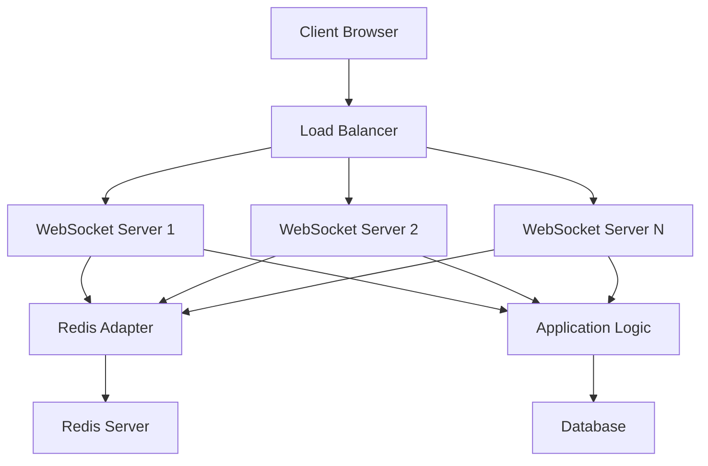

# rulimena.io WebSocket Infrastructure

## Overview
This document outlines the real-time communication infrastructure for rulimena.io using WebSocket technology. The system enables live call monitoring, agent status tracking, and real-time dashboard updates essential for a predictive dialer system.

## Real-time Communication Requirements

### Core Features
1. **Live Call Monitoring**: Real-time updates on call status and progress
2. **Agent Status Tracking**: Instant updates on agent availability and activity
3. **Dashboard Updates**: Real-time statistics and metrics for supervisors
4. **Campaign Progress**: Live updates on campaign performance
5. **Notification System**: Instant alerts for important events

### Performance Requirements
- **Latency**: < 100ms for status updates
- **Scalability**: Support for 1000+ concurrent connections
- **Reliability**: 99.9% uptime for real-time communication
- **Fallback**: Automatic reconnection mechanisms

## WebSocket Server Implementation

### Technology Stack
- **Socket.IO**: Real-time bidirectional event-based communication
- **Redis Adapter**: For scaling across multiple server instances
- **Node.js**: Server-side JavaScript runtime
- **PM2**: Process manager for Node.js applications

### Server Architecture



### Connection Lifecycle

1. **Connection Establishment**
   - Client connects to WebSocket server
   - Authentication token validation
   - User role verification
   - Room assignment based on user context

2. **Event Subscription**
   - Client subscribes to relevant event channels
   - Server validates subscription permissions
   - Connection added to appropriate rooms

3. **Real-time Communication**
   - Server emits events to relevant clients
   - Clients receive and process real-time updates
   - Bidirectional communication for interactive features

4. **Connection Termination**
   - Graceful disconnection handling
   - Cleanup of user sessions
   - Notification to relevant parties

## Event Handling System

### Core Events

#### Agent Events
- `agent:status-update`: Agent status changes (available, on-call, break, etc.)
- `agent:call-started`: Agent begins a call
- `agent:call-ended`: Agent completes a call
- `agent:performance-update`: Agent metrics update

#### Call Events
- `call:queued`: New call added to queue
- `call:ringing`: Call is ringing
- `call:connected`: Call successfully connected
- `call:disconnected`: Call ended
- `call:status-changed`: Call status updated

#### Campaign Events
- `campaign:started`: Campaign begins
- `campaign:paused`: Campaign paused
- `campaign:completed`: Campaign finished
- `campaign:stats-update`: Campaign statistics update

#### Dashboard Events
- `dashboard:live-stats`: Real-time dashboard metrics
- `dashboard:agent-activity`: Agent activity summary
- `dashboard:call-volume`: Call volume statistics
- `dashboard:performance-metrics`: Overall performance data

### Event Payload Structure

```javascript
{
  "event": "agent:status-update",
  "timestamp": "2023-05-15T10:30:00.000Z",
  "data": {
    "agentId": "agent-123",
    "agentName": "John Doe",
    "previousStatus": "available",
    "newStatus": "on-call",
    "callId": "call-456"
  },
  "roomId": "campaign-789"
}
```

## Agent Status Tracking

### Status Definitions
1. **Available**: Ready to receive calls
2. **On Call**: Currently engaged in a call
3. **Break**: On a scheduled break
4. **Lunch**: On lunch break
5. **Training**: In training session
6. **Offline**: Not available for calls
7. **Wrap-up**: Completing post-call tasks

### Status Update Mechanism
- Automatic status changes based on system events
- Manual status updates by agents
- Timeout-based status changes (e.g., auto-break after inactivity)
- Integration with calendar systems for scheduled breaks

### Presence System
- Real-time presence indicators
- Last seen timestamps
- Activity heatmaps
- Availability predictions

## Room Management

### Room Types
1. **Agent Rooms**: Individual agent-specific rooms
2. **Campaign Rooms**: Campaign-specific rooms for team collaboration
3. **Supervisor Rooms**: Supervisor-specific monitoring rooms
4. **Dashboard Rooms**: Real-time dashboard update rooms
5. **Admin Rooms**: Administrative monitoring rooms

### Room Assignment Logic
- Users automatically assigned to relevant rooms on connection
- Dynamic room creation for new campaigns
- Room membership updates based on user roles and permissions
- Automatic cleanup of inactive rooms

## Scalability Architecture

### Horizontal Scaling
- Multiple WebSocket server instances behind load balancer
- Redis adapter for shared state across instances
- Session affinity for consistent user experience
- Automatic scaling based on connection load

### Load Distribution
- Connection count monitoring
- CPU and memory usage tracking
- Automatic instance provisioning
- Graceful degradation during high load

### Message Broadcasting
- Efficient message routing to relevant clients
- Message batching for high-frequency updates
- Selective broadcasting based on room membership
- Prioritization of critical updates

## Security Measures

### Authentication
- JWT token validation for connection establishment
- Role-based access control for event subscriptions
- IP address filtering for additional security
- Rate limiting for connection attempts

### Data Encryption
- TLS encryption for all WebSocket connections
- End-to-end encryption for sensitive data
- Secure token generation and validation
- Session hijacking prevention

### Access Control
- Event-level permission checking
- Room membership verification
- Real-time authorization updates
- Audit logging for all WebSocket activities

## Client-Side Implementation

### Connection Management
- Automatic reconnection with exponential backoff
- Connection state monitoring
- Error handling and recovery
- Fallback to polling for unsupported environments

### Event Handling
- Event listener registration
- Real-time data processing
- UI updates based on WebSocket events
- Offline state management

### Performance Optimization
- Efficient data serialization
- Event throttling for high-frequency updates
- Memory leak prevention
- Connection pooling

## Monitoring and Analytics

### Connection Metrics
- Active connection count
- Connection success/failure rates
- Average connection duration
- Geographic distribution of clients

### Event Metrics
- Event throughput statistics
- Latency measurements
- Error rates and types
- Popular event subscriptions

### Performance Dashboards
- Real-time connection monitoring
- Event processing performance
- System resource utilization
- Alerting for anomalies

## Error Handling and Recovery

### Connection Errors
- Network interruption handling
- Server failure detection
- Graceful degradation strategies
- User notification of connection issues

### Data Consistency
- Message ordering guarantees
- Duplicate message detection
- Missed update recovery
- State synchronization mechanisms

### Fallback Mechanisms
- Polling-based fallback for critical data
- Local storage for offline data persistence
- Manual refresh options
- Degraded mode operation

## Testing Strategy

### Unit Testing
- Event emission and handling
- Room management logic
- Authentication validation
- Error condition handling

### Integration Testing
- End-to-end connection flows
- Multi-server communication
- Load testing scenarios
- Failover testing

### Performance Testing
- Connection scalability testing
- Message throughput benchmarks
- Latency measurements
- Resource utilization analysis

## Deployment Considerations

### Infrastructure Setup
- Load balancer configuration
- SSL certificate management
- Redis cluster setup
- Monitoring and alerting systems

### Maintenance Procedures
- Rolling updates with zero downtime
- Connection draining for server maintenance
- Data backup and recovery procedures
- Disaster recovery planning

### Monitoring and Alerting
- Real-time health checks
- Performance metric collection
- Anomaly detection
- Automated incident response